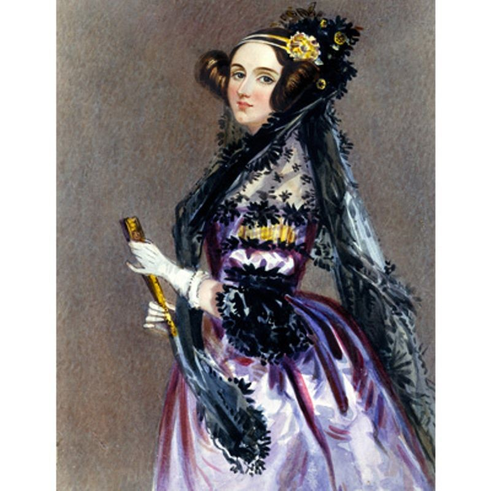
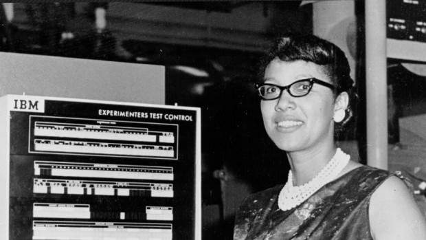
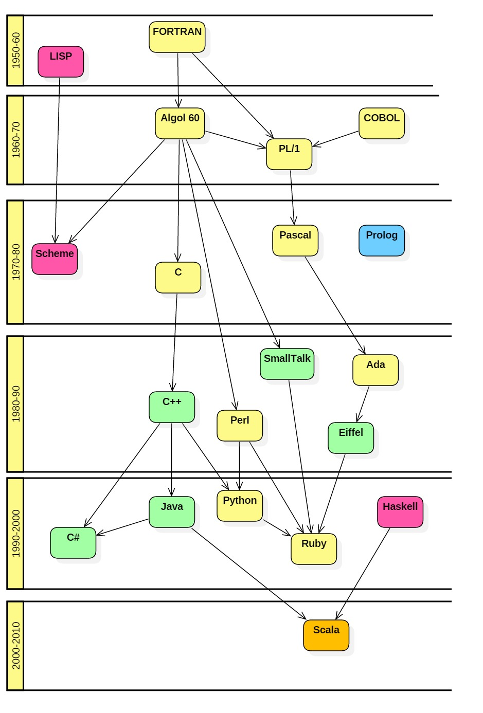

### Paleo-Programing Facts 

| 1843:  [Ada Lovelace](https://en.wikipedia.org/wiki/Ada_Lovelace) wrote [the first computer program](https://twobithistory.org/2018/08/18/ada-lovelace-note-g.html) calculating the Bernoulli numbers. |
|:--:| 
|  | 
|*> In 1842, the Italian mathematician Luigi Federico Menabrea published a description of the Analytical Engine, a proposed mechanical general-purpose computer, based on a lecture by Babbage in French. In 1843, the description was translated into English and extensively annotated by Ada Lovelace, who had become interested in the engine eight years earlier. In recognition of her additions to Menabrea's paper, which included a way to calculate Bernoulli numbers using the machine (widely considered to be the first complete computer program), she has been described as the first computer programmer.  (from https://en.wikipedia.org/wiki/Analytical_Engine* )|

| 1950s: IBM develops the [FORTRAN](https://en.wikipedia.org/wiki/Dorothy_Vaughan) for scientific and engineering applications, FORTRAN came to dominate this area of programming early on and has been in continuous use for over half a century in computationally intensive areas. |
|:--:| 
|  | 

| 1949: [Dorothy Vaughan](https://en.wikipedia.org/wiki/Dorothy_Vaughan) became acting supervisor of the West Area Computers, the first African-American woman to supervise a group of staff at the center. |
|:--:| 
|  | 
|*> During her 28-year career, Vaughan prepared for the introduction of machine computers in the early 1960s by teaching herself and her staff the programming language of FORTRAN; she later headed the programming section of the Analysis and Computation Division (ACD) at Langley. (source https://en.wikipedia.org/wiki/Dorothy_Vaughan)* |

***
### Programing languages evolution 

|  | The "phylogenetic" tree of languages | 
|:--:|:--:|
| *(source http://www.cs.sjsu.edu/faculty/pearce/modules/lectures/languages3/history/evolution.htm)* |

***
### A quick history of Python 

| | |
|:--:|:--:|
| |https://en.wikipedia.org/wiki/Guido_van_Rossum | 

Python2.x will be dismissed in 2020. Current relase is Python3.x. Read more about [current Python release](https://wiki.python.org/moin/Python2orPython3)

| | |
|----|----|
| Python tutorial | https://docs.python.org/3/tutorial/  |
|Python for mathematics, science, and engineering | https://scipy.org/ |
| Python official website | https://www.python.org/  |

*** 
### Hands-on Python 

#### Setup 

1. Connect to the server as described [here](../WiFi-SSHinstruction.md) 
2. In your home make a folder that you will use for all the python. Use a meaningful name *be consistent and descriptive*  

See suggestions for naming [here](https://library.stanford.edu/research/data-management-services/data-best-practices/best-practices-file-naming)

3. Download the toy-dataset and the code from here using wget 

#### From now we will follow the Software Carpentry lessons 

